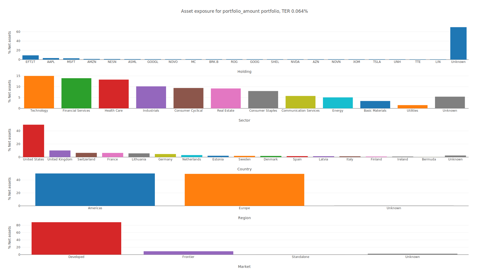

# portfolio-exposure-analyzer



## Overview

`portfolio-exposure-analyzer` is a CLI tool that visualizes the portfolio exposure by the following categories: __holdings__, __country__, __region__ and __market__ (by [MSCI classification](https://www.msci.com/our-solutions/indexes/market-classification)).

It takes two CSV files as input arguments. The first file describes all the securities in your portfolio and the second one contains the securities in your portfolio together with their proportions.

> NB! Should you get any errors about unknown sector or market/region not defined for a specific country, then these can be added into the specific hashmap in [`config.rs`](./src/config.rs) file.

### Securities file format

The securities __CSV__ file should contain entries in the following format:  
`ISIN,Name,TER,Holding,HoldingWeight,Sector,SectorWeight,Country,CountryWeight,Region,RegionWeight`

One security may need multiple lines to describe all the holdings, countries, sectors or regions it affects. One does not need to repeat the values that have already been provided on a previous line (eg ISIN, Name and TER), so these fields can be left empty as well as other fields that do not have values.

> __Note:__ If region values are omitted, then the region is calculated based on given countries and their weights

One can also include funds (eg. pension funds) which consist of stocks or ETFs in the scurities file. In such a case you only need to fill values up to and including the `HoldingWeight` of the fund and the rest of the values (sector, country and region) will be calculated based on the securities included in the fund. For funds, the `Holding` value should contain the ISIN of the stock or ETF included in the fund and the corresponding/referred security should also be described elsewhere in the file.

For an example see the [`example/securities.csv`](./example/securities.csv) file.

### Portfolio file format

The portfolio CSV file has two possible formats:  
`ISIN,Amount`, where the `Amount` is a monetary value
or  
`ISIN,Weight`, where `Weight` is a percentage value out of the whole portfolio.

> __Note:__ `Amount` should be in the same currency for every security.

For an example for the amount format see the [`example/portfolio_amount.csv`](./example/portfolio_amount.csv) file and for the weight format see the [`example/portfolio_weight.csv`](./example/portfolio_weight.csv) file.


## Basic Usage

The portfolio exposures for the two examples in the [`example`](./example/) folder can be run created like so:
```sh
$ git clone git@github.com:r0mi/portfolio-exposure-analyzer.git
$ cd portfolio-exposure-analyzer
$ cargo run -- example/securities.csv example/portfolio_amount.csv -i -f svg
$ cargo run -- example/securities.csv example/portfolio_weight.csv -i -f svg
```

The tool will always generate an HTML output  file with exposure graphs that can be viewed in any browser. The `-i` flag will additionally save the output as a static image and `-f` flag specifies the image format as SVG.

To see all the available command line options, use the `--help` argument like so:  
```$ cargo run -- --help```

## Contributing

* If you've spotted a bug or would like to see a new feature, please submit an issue on the [issue tracker](https://github.com/r0mi/portfolio-exposure-analyzer/issues).
* Pull requests are welcome. For major changes, please open an issue first to discuss what you would like to change.

## License

The tool is dual licensed under [UNLICENSE](https://unlicense.org/) or [MIT](https://mit-license.org/)
